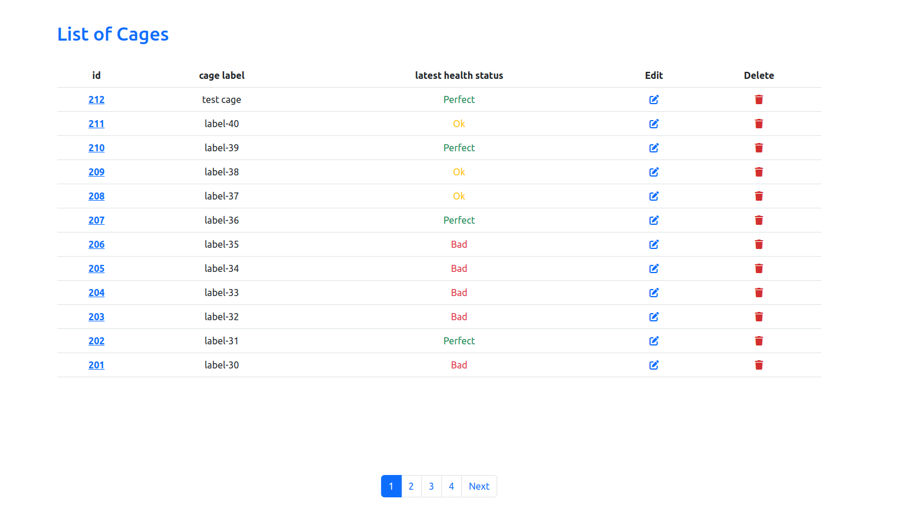
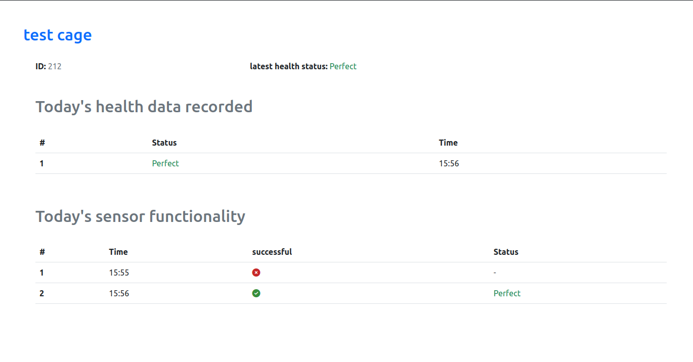
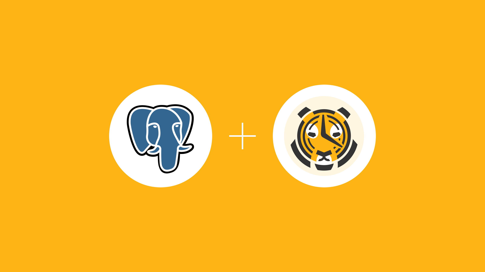
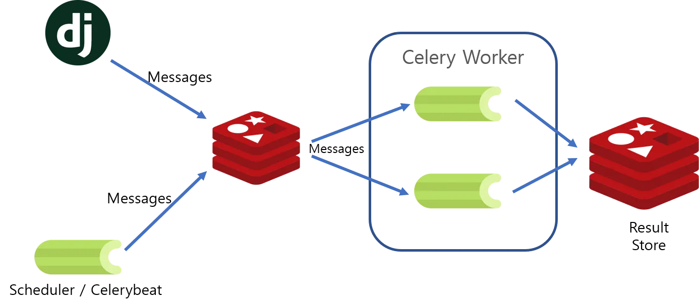

# My Neurocage interview project

## **Description**
This project contains a web application developed with the Django framework that illustrates some of the functionalities of the systems in Neurocage in a very abstract picture. Let's dive into the technical details of it.

## **Project Structure**
This project includes two main separate sections. The web application and the sensor API, which had been developed before, and now it is used as an API service in the system.

The Django application is responsible for creating frontend views and handling requests receiving the system. It consists of a CreateView for creating cages and a ListView for displaying the cages that created by user and DetailView for details about sensor of each cage and the related tables. In general and in the case of having sensor data in the database, it has two main tables. The first one is for all the correct received data and the other one is for listing all the requests for the cage and their successful and health statuses. The following images display these two pages.
   
   
   

As can be seen in the first image, editing and deleting each cage has been provided for the users in the list.

## **Technologies**
1. ### **Database**
In this project, I have used TimeScaleDB, which is an extension of PostgresDB to store the data of the web application. Because of some special tables called heypertables, this is capable of working with time-series data so much faster than other databases. I read somewhere that it might be over 8000 times faster!



<br>

2. ### **Backgorund task handling**
In order to make sure that the web application runs smoothly and without any delays, developers must offload any time/resource-intensive task, which runs independently from the web application service. In particular, when the web server receives lots of requests from the users. In the case of running those tasks synchronously, our pages are prone to load so much slower. In order to tackle this problem, I have utilized Celery, which is a task queue and task scheduler, and Redis as a message broker. 
This Django app needs to call the sensor mock API every 1 minute and stores the data in the database. In this case, a Celery worker, which runs on another server/container, takes the task and completes it, and then returns back the result to the Django app to save it. Between our Django app and the celery worker, there is a message broker responsible for delivering those tasks between the Django and celery workers. When the result of a task comes, the celery worker stores it in the Redis and Django reads it back and stores it in the database.

<div style="background-color: white;">
<br>

<br>
</div>

The image above illustrates the process of delivering tasks to celery workers and getting back the results. It is worth mentioning that there is only one Redis server in our system. The capability of using Redis as a message broker and a database makes it stands out compare to other message brokers like RabitMQ.

<br>

## **How to run it?**
For running this project, you can clone this repo into your local machine and then just run:

```shell
docker compose up -d --build
```

And the you can find the application in ```http://localhost```.